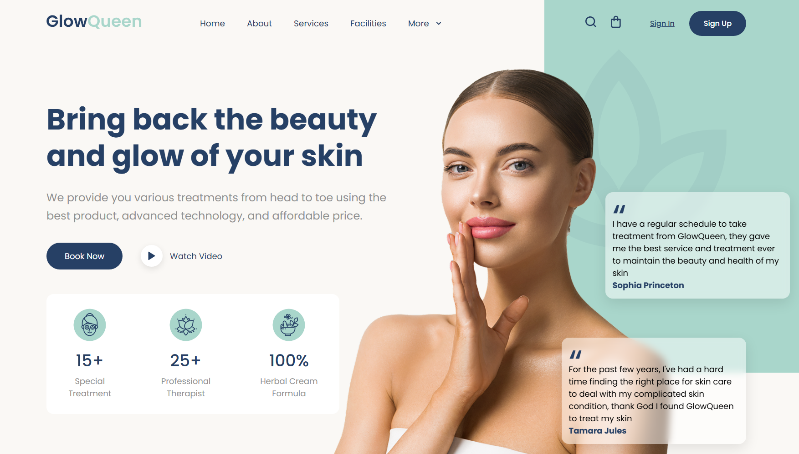

# Spa & Beauty Landing Page

A modern, responsive landing page for a spa and beauty business. Built with semantic HTML and modular SASS for a Fullstack Development Master course.



## Semantic HTML Structure

- **`<header>`**: Contains the site navigation and logo.
  - **Logo**: SVG image for branding.
  - **Navigation (`<nav>`)**: Main links (`Home`, `About`, `Services`, `Facilities`, `More`) and action buttons (`Sign In`, `Sign Up`).
- **`<main>`**: Main content area.
  - **Hero Section (`<section class="hero">`)**: 
    - **Hero Content**: Headline, subtext, call-to-action buttons, and stats.
    - **Hero Image**: Model image and floating testimonial cards.
- **`<footer>`**: (Not present, but can be added for copyright/info.)

## SASS Components

- **`_variables.scss`**: Defines color palette, fonts, and spacing variables.
- **`_reset.scss`**: Resets browser default styles for consistency.
- **`main.scss`**: Main styles, imports variables and reset, and styles all page sections:
  - Layout (`.content`, `.site-header`, `.nav`, `.hero`, etc.)
  - Buttons, cards, stats, testimonials, and responsive design.

## Getting Started

### Prerequisites

- [Node.js](https://nodejs.org/) (v18+ recommended)
- [Git](https://git-scm.com/)

### Installation

1. **Clone the repository:**
   ```sh
   git clone <your-repo-url>
   cd spa-and-beauty
   ```

2. **Install dependencies:**
   ```sh
   npm install
   ```

3. **Start the development server:**
   ```sh
   npm run dev
   ```

4. **Open [http://localhost:5173](http://localhost:5173) in your browser.**

## Project Structure

```
spa-and-beauty/
├── index.html
├── package.json
├── public/
├── src/
│   ├── main.js
│   ├── counter.js
│   ├── style.css
│   ├── img/
│   └── styles/
│       ├── _variables.scss
│       ├── _reset.scss
│       └── main.scss
```

## Customization

- **Edit HTML** in `index.html` for content changes.
- **Modify styles** in `src/styles/main.scss` and variables in `_variables.scss`.
- **Add images** to `src/img/`.

---

**Enjoy building and customizing your spa